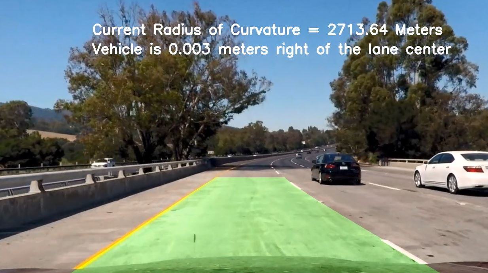
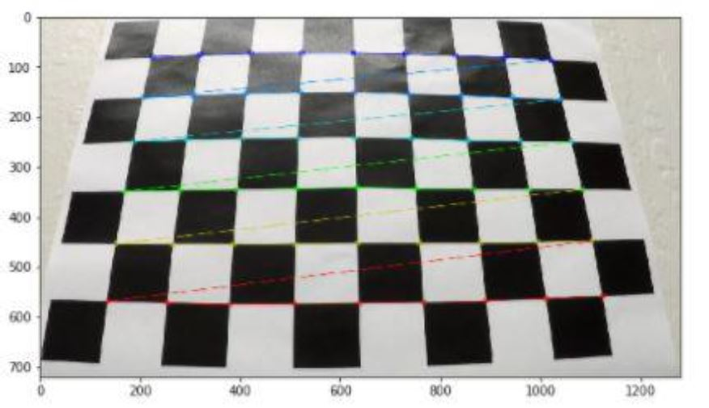
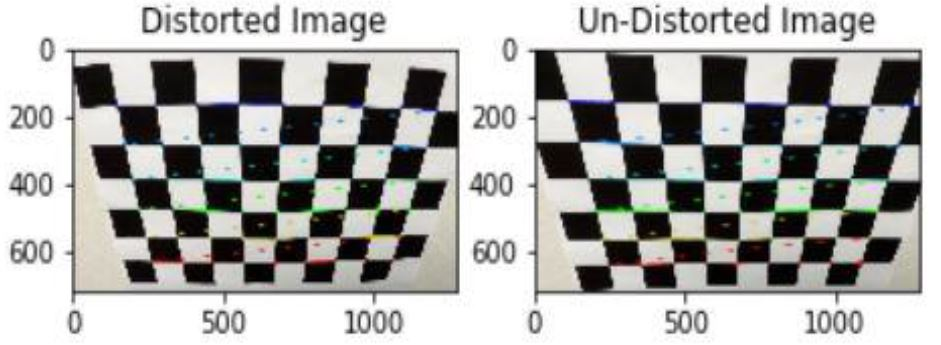
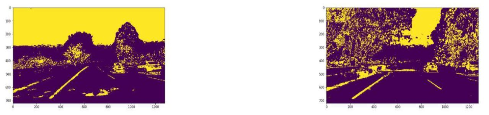
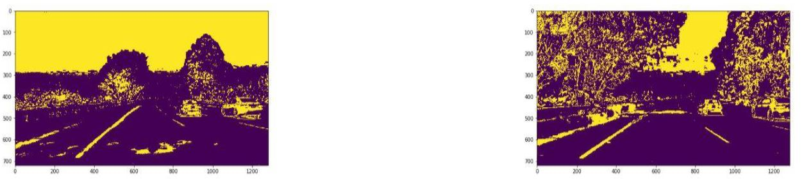
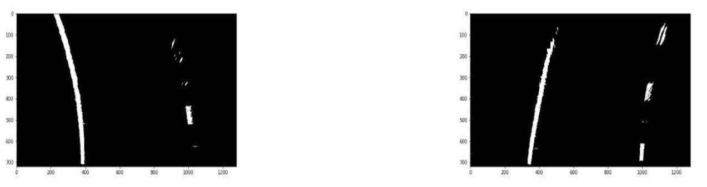
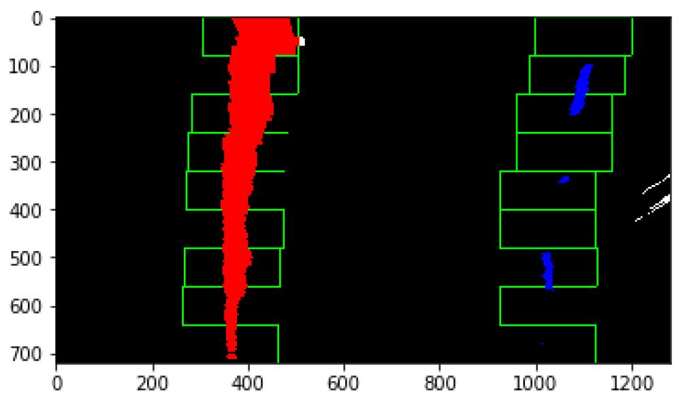
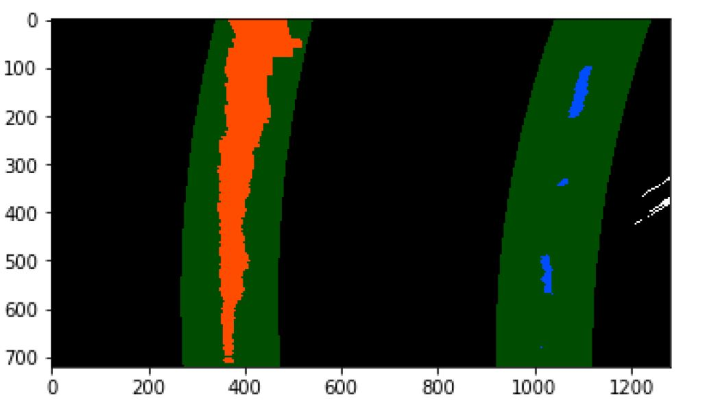

# Advanced Lane Finding Project

<figure>
 
 <figcaption>
 

 
 </figcaption>
</figure>

## The goals / steps of this project are the following:
   - Compute the camera calibration matrix and distortion coefficients given a set of chessboard images.
   - Apply a distortion correction to raw images.
   - Use color transforms, gradients, etc., to create a thresholded binary image.
   - Apply a perspective transform to rectify binary image ("birds-eye view").
   - Detect lane pixels and fit to find the lane boundary.
   - Determine the curvature of the lane and vehicle position with respect to center.
   - Warp the detected lane boundaries back onto the original image.
   - Output visual display of the lane boundaries and numerical estimation of lane curvature and vehicle position.
   
- **Rubric Points**
- **Here I will consider the rubric points individually and describe how I addressed each point in my implementation.**

- **Camera Calibration**
   - 1. I’ve used 17 image of the chess board calibration images to collect corner points in order to use these points together with the object points in the camera calibration.
      - I started by preparing "object points", which will be the (x, y, z) coordinates of the chessboard corners in the world. Here I am assuming the chessboard is fixed on the (x, y) plane at z=0, such that the object points are the same for each calibration image. Thus, objp is just a replicated array of coordinates, and objpoints will be appended with a copy of it every time I successfully detect all chessboard corners in a calibration image. imgpoints will be appended with the (x, y) pixel position of each of the corners in the image plane with each successful chessboard detection.
      - I then used the output objpoints and imgpoints.
   - 2. Using cv2.calibrateCamera API I got the camera matrix & distortion coeffs which are needed for the un-distortion step next, please look for my own API “camera_calibrate()” implemented for this purpose.(Note: You’ll find a sufficient demonstration about it in the related markdown and code comments).
   

<figure>
 
 <figcaption>
 

 
 </figcaption>
</figure>

- **Pipeline (single images)**
   - **1. Provide an example of a distortion-corrected image.**
   - To demonstrate this step, I will describe how I apply the distortion correction to one of the test images like this one:
      - 1. I applied this distortion correction to the test image using the cv2.undistort() function and obtained this result:
         <figure>
          
          <figcaption>
          

 
          </figcaption>
         </figure>
---      
   - **2. Describe how (and identify where in your code) you used color transforms, gradients or other methods to create a thresholded binary image.** 
   - Provide an example of a binary image result.
   - I used a combination of color and gradient thresholds to generate a binary image.
   - Here’re the preprocessing related APIs in my pipeline:
      - 1- abs_sobel_thresh()
         - Applies sobel operator in X or Y direction, and returns a binary masked image.
      - 2- mag_thresh()
         - Determine the sobel in X or Y direction magnitude and returns a binary masked image.
      - 3- dir_threshold()
         - Applies the sobel direction filter iand returns a binary masked image.
      - 4- grad_combine()
         - Combine selectable variety of the above listed gradients and returns a binary masked image.
      - 5- hls_select()
         - Extract selectable H,L,S channels of the image and returns a binary masked image (In our case I’ve combined L & S channels as this combination removed a lot of noise from the gradient binary image).   
      - 6- grad_hls_combine()
         - Combines between HLS & gradient previous selections (In our case a combination of sobel X operator is done with L,S channels combination) and returns a binary masked image.
      - 7- frame_processor()
         - This is the high level (Wrapper/Interface) function which calls each of:
         
         - 7.1- Undistortion API.
         - 7.2- grad_hls_combine() API.
         - 7.3- persp_tarnsform() API.
            - Respectively in order to complete the frame preprocessing in order to start looking for the lane lines points.
            
      - 8- persp_tarnsform()
         - Uses the undistorted images to create a new image perspective (Bird’s Eye Perspective in our case) as this should be more powerful perspective in detecting the lane lines using the slider window approach comes next.

   - **Note1:** All of these listed APIs are well commented in the notebook for further details.
---
   - **3. Describe how (and identify where in your code) you performed a perspective transform and provide an example of a transformed image.**
   
   - **Note2: for src & dist points sets selection:**
   - I started collecting src points using different approaches:
      - Specifying four points on the lanes of a straight lanes test image starting from the bottom of image(y=720) until reasonable height (y~400).
      - Then, as I experienced video output I tried to fine tune the collected points up and down.
      - For dist points, I’ve looked for some Udacity mentors from the discussion forums.   
      
      
   - **Preprocessing outputs:**
      - 1- HLS Combinations: 
         - S channel only.
         
         <figure>
          
          <figcaption>
          

 
          </figcaption>
         </figure>

      - 2- Gradient& HLS Combination:
         - SobelX & S channel.
         
         <figure>
          
          <figcaption>
          

 
          </figcaption>
         </figure>
         
      - 3- Undistortion & Perspective Transformation:
      
         <figure>
          
          <figcaption>
          

 
          </figcaption>
         </figure>
         
---
        
   - **4. Describe how (and identify where in your code) you identified lane-line pixels and fit their positions with a polynomial?**
      Looking at the notebook you’ll find the two following APIs:
         - **1- Blind_slide_window_detector().**
         - **2- slide_window_detector().**
      - These APIs implement the window slider approach in detecting the lane lines.
      - The difference between them is that the blind detector starts locating the window from scratch without any aid of other functions.
      - And the slider detector depends mainly on a previously fitted polynomials for the left and right lines returned by the blind slider.
      - We should only need to the blind slider either in the start of detection or when the normal slider results are not satisfying the associated sanity checks(comes then).
      - **Note:** All of these listed APIs are well commented in the notebook for further details.
      - The resulted images from the both sliders are like:
         - **1- Blind_slide_window_detector()**
         
         <figure>
          
          <figcaption>
          

 
          </figcaption>
         </figure>
         
         - **2- slide_window_detector()**
         
         <figure>
          
          <figcaption>
          

 
          </figcaption>
         </figure>
---         
   - **5. Describe how (and identify where in your code) you calculated the radius of curvature of the lane and the position of the vehicle with respect to center.**
      - Looking at the notebook you’ll find the following API:
      -**lane_curvature()**
      - This API is responsible for:
         - 1- Determining the average lane width of the current frame through determining it on different random sets of left & right detections and get the average of these values.
         - 2- Printing the determined value out on the video frame.
         - 3- Determining the average shifting space of the current vehicle center from the lane center line -assuming that the vehicle center is aligned with image center- through determining it on different random sets of left & right detections and get the average of these values.
         - 4- Printing the determined value out on the video frame.
---         
   - **6. Provide an example image of your result plotted back down onto the road such that the lane area is identified clearly.**
   
      <figure>
       
       <figcaption>
       

 
       </figcaption>
      </figure>
---      
## Discussion

   - **1. Briefly discuss any problems / issues you faced in your implementation of this project. Where will your pipeline likely fail? What could you do to make it more robust?**
      - Okay! Let me point out some of the major problems I suffered from during implementation and tuning:
         - 1- Detections Smoothing:
            I’ve really put lot of effort and time to implement lane_detect_withSMOOTHING() API and ended up not using it at all as it didn’t seem to add a big enhancement to the pipeline also due to the penalty of errors it showed during its developing due to the sizes and shapes conflicts that’s why I ended up not using it.
         - 2- Sanity Checks Failure:
            I had to test on lot of images to get the sense of how should each check affect the detections confidence in order to not start the blind search with each new frame.
         - Promising Future Enhancements
            1- Work more on the smoothing API until it get mature enough to help in reducing the fluctuations.
            2- Sorting of detections upon predefined confidence levels determined by the sanity checks results.
   